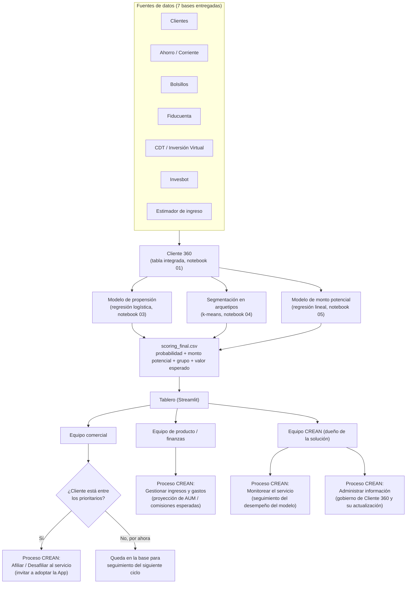

# Modelo conceptual y diagrama de procesos

## Propósito

Este documento muestra cómo la solución analítica construida (notebooks 00 a 05) se
integra al funcionamiento real del banco: qué información fluye entre cada pieza, quién
consume cada resultado, y en qué procesos de CREAN se apoya esa información para tomar
decisiones.

## Diagrama

## Actores involucrados

| Actor | Qué recibe | Qué decide |
|---|---|---|
| Equipo comercial | Lista de clientes ordenada por probabilidad de adopción y valor esperado (tablero) | A qué clientes contactar primero para invitarlos a la App |
| Equipo de producto / finanzas | Dimensionamiento agregado (clientes esperados, volumen de inversión esperado por segmento y grupo) | Cómo proyectar el impacto del lanzamiento e informar metas de negocio |
| Equipo CREAN | Resultados del modelo y su evolución en el tiempo | Cuándo reentrenar los modelos, ajustar supuestos o resolver incidencias de datos |

## Flujo de información, en una frase por paso

1. Las 7 fuentes de datos se integran y limpian en una sola tabla por cliente (**Cliente 360**).
2. Sobre esa tabla se calculan tres resultados independientes: **probabilidad de adopción**, **grupo/arquetipo** y **monto potencial de inversión**.
3. Los tres resultados se combinan en una sola tabla (**scoring_final.csv**) con un valor esperado por cliente.
4. Esa tabla alimenta el **tablero**, que es el punto de consumo para los distintos equipos.
5. Cada equipo usa el tablero para un fin distinto, y esas decisiones se conectan directamente con procesos que CREAN ya tiene definidos.

## Punto de decisión central

El punto de decisión más relevante del flujo es el que enfrenta el equipo comercial al
mirar el tablero: **¿este cliente está entre los prioritarios para contactar en este
ciclo?** Esa decisión es la que efectivamente activa el proceso de **Afiliar al
servicio** — es donde el resultado analítico se convierte en una acción concreta sobre un
cliente real.

Los clientes que no quedan priorizados en un ciclo no se descartan: permanecen en la base
y su score se recalcula en el siguiente ciclo de actualización (ver esquema de operación).
